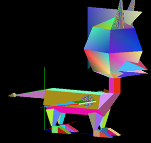
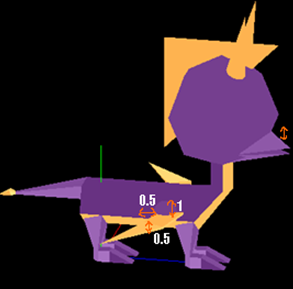

# SPYROpenGL


[](https://img.shields.io/badge "Version du projet")

## Projet de Synthèse d'image portant sur la création d'un dragon (ici Spyro en version PS1) avec C++ et OpenGL.


### I) Introduction

Le projet SPYROpenGL est le projet demandé dans la matière Synthèse d’Image. Ce nom est la
concaténation de SPYRO, notre dragon modélisé, et d’OpenGL, le langage (avec C++) pour modéliser ce
personnage. Dans ce document, nous allons voir pourquoi nous avons choisis ce sujet, les étapes de
conceptions de celui-ci ainsi que quelques informations supplémentaires.
#### Pourquoi Spyro?

Le sujet étant de réaliser un dragon en 3D avec OpenGL, nous avons donc cherché les différents
dragons iconiques des jeux vidéo. Parmi ceux qui sont ressortis de ce brainstorming, il y avait Spyro. Mais
alors pourquoi choisir Spyro plutôt qu’un autre dragon?
La trilogie des Spyro sur PS1 fut marquante pour beaucoup de joueurs car possédant un univers riche,
de très beaux graphismes (pour l’époque, années 1998-2000) mais surtout un personnage « classe » et
« charismatique ». Spyro avait du style et on pouvait facilement s’identifier à lui, ce qui en a fait une figure
pour beaucoup comme a pu l’être Sonic pour d’autres.
#### Utilisation des ressources de Spyro

Afin de mener à bien notre projet, nous avons utilisé des ressources officielles de Spyro, le projet étant
privé et non-commercial, cela ne devrait pas poser de problèmes. Nous avons donc utilisé les ressources
suivantes :
* Fichiers textures et obj
   * Fichier texture provenant du jeu Spyro 2 sur PS1 (Officiel)
   * Fichier obj provenant du jeu Spyro 2 sur PS1 (Officiel)
   * [Lien vers le site](https://www.models-resource.com/playstation/spyro2riptosrage/model/26411/ "The Models Resource")
* Fichiers de musique
   * Dark Hollow (Spyro The Dragon Reignited - 1 )
   * Enchanted Towers (Spyro The Dragon Reignited - 3 )
   * Sgt. Byrd's Theme (Spyro The Dragon Reignited - 3 )
   * [Lien vers le site](https://www.youtube.com/watch?v=L7Rqf4s8KQ0&list=PLo6SSHo84XM6OOrVDvXmms5jdiOeyC0wg "YouTube")
* Fichier audio
   * « Salut moi c’est Spyro » d’une cinématique (Spyro The Dragon Reignited - 2)
   * [Lien vers le site](https://www.youtube.com/watch?v=ovA1417TuOM&t=75s "YouTube")

Bien sûr le fichier OBJ à uniquement été utilisé lors de l’étape de conception du projet comme modèle.

### II) Conception

Le fichier OBJ présentant Spyro avec des formes trop complexes pour nous, on a donc divisé Spyro en
plusieurs parties et avec ce fichier, on a décidé des différents solides à utiliser pour monter notre propre Spyro.
Puis on a ensuite divisé la création en OpenGL de ce personnage en différentes classes afin de commencer
sur des bases solides.

#### Découpage de Spyro

Armé de Blender avec notre fichier OBJ et d’un grand tableau blanc, on découpe Spyro en 11 parties :
que nous allons ensuite découper en solides

* Les ailes
* La bouche
* Les cornes
* Le corps
* Le cou
* La crinière
* Les jambes
* Le nez
* Les pieds
* La queue
* La tête

Sur chaque partie, on prend notre tableau blanc et on cherche les solides ou ensembles de solides
basiques permettant de réaliser celle-ci.

Voici un exemple pour la réalisation d’un pied de Spyro :
Afin de réaliser le pied de Spyro, je le découpe en trois parties :
* Les doigts de pieds unis en un **prisme triangulaire rectangle**
* Le centre du pied en un **cube**
* Le talon/attache de la jambe en un **prisme triangulaire équilatéral**


#### Diagramme de classe

Afin de ne pas commencer la programmation à l’aveugle, nous effectuons un diagramme de classes,
avec les différentes méthodes nécessaires à la bonne réalisation du projet.

Chacune des classes de ce diagramme est une classe statique (sauf la classe Point). Les classes sont
expliquées à la suite du diagramme UML.


##### 1. Classe Point :

Cette classe est une classe très sommaire car permettant de créer des points à l’aide des coordonnées X, Y
et Z. Elle est utilisée lorsqu’il y a besoin de retourner un point ou de passer un point en paramètre au sein
d’une méthode.

##### 2. Classe Dessin :

Cette classe est la classe de plus bas niveau. En effet celle-ci gère la création de figures géométriques en 3D
telles que la sphère ou le cube. C’est une classe statique, elle est donc appelable directement depuis
n’importe où sans avoir à l’instancier.

##### 3. Classe Création :

Cette classe est la classe de création des différentes parties du corps de Spyro. En effet elle utilise les
méthodes statiques de la classe Dessin afin de monter à l’aide de translations et rotations les parties du
corps. Cette classe est également statique.

##### 4. Classe Montage :

Cette classe est la classe du plus haut niveau. En effet elle assemble à l’aide de translations et rotations
toutes les méthodes statiques de la classe Création. Cette classe est également statique.

##### 5. Classe IntermittentDuSpectacle :

L’intermittent du spectacle permet de jouer de la musique en arrière-plan, parmi 3 musiques différentes
aléatoirement, et ce sans jamais jouer la même d'affilé (quel talent !). Il crie également « Salut, Moi c’est
Spyro » lors de l’appuis de la touche ESPACE.

#### Répartition des tâches :

Afin de ne pas effectuer les mêmes tâches dans le projet, nous avons divisés les taches les plus faciles
et gardé en commun les taches les plus complexes. Voici donc la répartition des tâches :

Samuel LACHAUD :

```
Jambes, Pieds, Ailes, Tête, Cornes, Crinière.
```
Loïs PAZOLA :

```
Queue, Corps, Cou, Bouche, Nez.
```
Taches Communes :

```
Application des texture, Animation, mise en place des sons, Lumières
```

### III) Réalisation

Spyro est maintenant modélisé complètement à l’aide de Solides créés dans la classe Dessin.

En effet tous les solides sont créés par nos soins, aucun solides GLUT ne sont utilisés dans ce projet. Pour le moment,
la méthode RandomColor3f() est utilisée car elle nous permet d’apercevoir clairement les délimitations de chaque faces 
de chaque solides.

Voici donc Spyro dans sa première phase :



Nous sommes cependant loin de l’aspect réel de Spyro, et la première chose à modifier ce sont ses couleurs, 
nous utilisons pour cela deux couleurs :

* Un jaune faiblement orangé : rgb(254, 179, 80)
* Un violet assez foncé : rgb(104, 50, 130)

Nous convertissons ensuite ces deux couleurs en float (entre 0 et 1). La conversion se fait facilement en
divisant par 255 nos composantes R, G et B de notre format homonyme. Cela nous donne donc nos deux
couleurs applicables. Cependant, avec uniquement ces deux couleurs, les différentes jonctions entre les
membres de Spyro ne seront pas bien visibles, nous considérons alors que ces deux couleurs sont les
dominantes et nous leurs appliquons un filtre composé d’un ajustement et d’un coefficient qui lui est lié :

* glColor3f(0.99607+a*coef, 0.70196+a*coef, 0.31372+a*coef);
* glColor3f(0.40784+a*coef, 0.19607+a*coef, 0.50980+a*coef);
   * a est l’ajustement, nous avons choisis d’ajouter 0.05 à nos valeurs en float
   * coef correspond à une valeur allant de 0 à 5 en fonction de la face, en effet on incrémente le coefficient sur chaque face d’un solide afin de changer faiblement l’ajustement permettant d’obtenir des couleurs différentes.

Nous obtenons donc notre version colorisée de Spyro :


#### Application des textures


Une fois les couleurs de Spyro appliquées, nous passons aux textures, la première texture portera
sur les yeux, la seconde sera une texture enveloppante sur une sphère.
Notre première texture s’applique sur les deux faces du devant sur la sphère qui forme la tête de Spyro,
elles sont appliquées face par face. C’est l’ajout qui manquait le plus au réalisme. Notre deuxième texture
supprime le triangle de crinière et le remplace par sa texture avec transparence. Pour cela, nous avons mis
une couleur bleue partout où fallait être transparent sur l'image, puis après avoir chargé la texture en RGB,
nous les convertissons en RGBA en vérifiant l'intensité de bleu de chaque pixel et si l'intensité est
suffisamment haute on met l'alpha à 0 (totalement transparent) et sinon à 255 (totalement opaque). A
noter que le triangle de crinière est maintenant un rectangle afin de mettre plus facilement une texture.
Voici donc Spyro avec ses yeux et sa crinière :


La deuxième texture est une texture enveloppante, sur une sphère. Spyro se situe dans la sphère,
on appelle cette texture donnant une zone de ciel une Skybox. Spyro se trouve alors maintenant dans un
environnement.

Voici donc Spyro avec son environnement :


#### Animation du modèle

Notre Spyro manque maintenant de vie, nous lui appliquons donc une animation automatique en temps réel
et une animation occasionnelle (lancée avec une touche du clavier détaillé en partie 4).

La première animation est le mouvement des ailes. L’animation s’effectue sur trois points différents, la première
partie de l’aile effectue une rotation sur l’axe Z, cependant elle effectue également une rotation sur l’axe X, mais deux
fois moins grande. En même temps s’effectue une rotation de la deuxième partie de l’aile de la même amplitude que la
rotation en X.

La deuxième animation s’effectue lors de l’appui sur la touche de clavier, Spyro bouge alors sa partie supérieure de sa
bouche de haut en bas jusqu’à la fin de l’animation sonore.



### IV) Utilisation du projet

Maintenant que nous avons vu la réalisation du projet et sa finition, nous allons voir les fonctionnalités
associées, plus particulièrement les touches claviers utilisées et la gestion de la musique, ceci nous permettant
une utilisation plus personnalisée du projet SPYROpenGL.

#### Utilisation du clavier

De nombreuses touches du clavier permettent d’utiliser facilement SPYROpenGL, voici la liste des
commandes permettant la navigation ou l’utilisation de fonctionnalités :
* ‘**z**’ → Permet de zoomer sur Spyro
* ‘**Z**’ → Permet de dézoomer sur Spyro
* ‘**i**’ et ‘**k**’ → Permettent de déplacer Spyro sur l’axe Y
* ‘**j**’ et ‘**l**’ → Permettent de déplacer Spyro sur l’axe X
* ‘**J**’ et ‘**L**’ → Permettent de déplacer Spyro sur l’axe Z
* ‘**q**’ → Permet de quitter l’application
* ‘**ESPACE**’ → Permet de faire bouger la bouche de Spyro avec le son de sa voix
* **Touches fléchées** → Permettent de rotationner la caméra autour de Spyro

#### Changement de musique de fond

En bonus, dans SPYROpenGL, de la musique est jouée en arrière-plan, celle-ci est jouée dans un thread
appelant des commandes Linux. Les trois musiques sont les suivantes :
Dark Hollow, Enchanted Towers, Sgt. Byrd's Theme
Elles sont donc jouées en arrière-plan. Il y’a quelques subtilités, quand une musique s’arrête, une autre
prend le relais, mais jamais la même d’affilé, évitant donc la redondance pour l’utilisateur. On peut
également passer à la musique suivante en appuyant sur ‘CTRL+C’ sur la deuxième fenêtre ouverte lors
de l’exécution nous avons donc l’affichage suivant permettant de savoir les informations de la musique
jouée actuellement :


#### Membres du projet :

* **Loïs PAZOLA** - [@Mahtwo](https://github.com/Mahtwo)
* **Samuel LACHAUD** - [@samlach2222](https://github.com/samlach2222)
